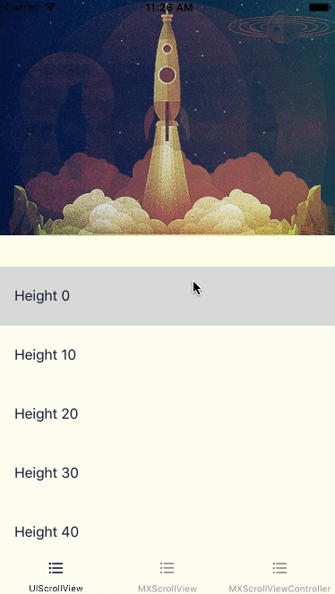
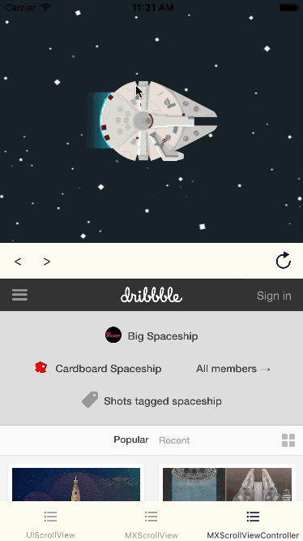

# MXParallaxHeader

[](https://www.travis-ci.com/github/ngochiencse/MXParallaxHeader)
[](http://cocoapods.org/pods/MXParallaxHeader)
[](https://swiftpackageindex.com/ngochiencse/MXParallaxHeader)
[](https://github.com/Carthage/Carthage)
[](http://cocoapods.org/pods/MXParallaxHeader)
[](http://cocoapods.org/pods/MXParallaxHeader)

MXParallaxHeader is a Swift conversion from https://github.com/maxep/MXParallaxHeader.

MXParallaxHeader is a simple header class for UIScrollView.

In addition, MXScrollView is a UIScrollView subclass with the ability to hook the vertical scroll from its subviews, this can be used to add a parallax header to complex view hierachy. Moreover, MXScrollViewController allows you to add a MXParallaxHeader to any kind of UIViewController.

|             UIScrollView        |           MXScrollViewController          |
|---------------------------------|-------------------------------------------|
|||

## Usage

If you want to try it, simply run:

```
pod try MXParallaxHeader
```

+ Adding a parallax header to a UIScrollView is straightforward, e.g:

```swift
let headerView = UIImageView()
headerView.image = UIImage(named: "success-baby")
headerView.contentMode = .scaleAspectFit

let scrollView = UIScrollView()
scrollView.parallaxHeader.view = headerView
scrollView.parallaxHeader.height = 150
scrollView.parallaxHeader.mode = .fill
scrollView.parallaxHeader.minimumHeight = 20
```

+ The MXScrollViewController is a container with a child view controller that can be added programmatically or using the custom segue MXScrollViewControllerSegue.

## Installation

### Swift Package Manager 

You can use  [Swift Package Manager](https://swift.org/package-manager/)  directly within Xcode or add it to the `dependencies` value of your `Package.swift`.

```swift
dependencies: [
    .package(url: "https://github.com/ngochiencse/MXParallaxHeader", .upToNextMajor(from: "1.1.8"))
]
```

### CocoaPods

MXParallaxHeader is available through [CocoaPods](http://cocoapods.org). To install it, simply add the following line to your Podfile:

```ruby
pod "MXParallaxHeader"
```

## Documentation

Documentation is available through [GitHub](https://ngochiencse.github.io/MXParallaxHeader/documentation/MXParallaxHeader).

## Author

[Hien Pham](https://github.com/ngochiencse)


## License

MXParallaxHeader is available under the MIT license. See the LICENSE file for more info.
